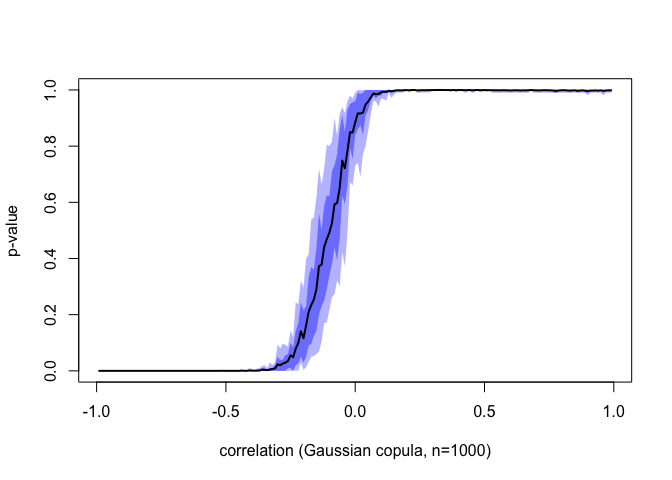

Testing PQD on Gaussian Vectors
================

``` r
library(mnormt)
library(scales)
n=1000
VR = seq(-.99,.99,by=.01)
VR = sample(rep(VR,50))
VP = rep(NA,length(VR))

Cn = function(u,U) mean((U[,1]<u[1])*(U[,2]<u[2]))
Cprod = function(u) u[1]*u[2]
Cnstar = function(u,U,idx) mean((U[idx,1]<u[1])*(U[idx,2]<u[2]))
Sn = function(h,U, vu, griduv){
  # vu = seq(1/(2*h),1-1/(2*h),length=h)
  # griduv = expand.grid(vu,vu)
  
  # cstar = apply(griduv, 1, Cprod)-apply(griduv, 1,Cn, U=U)
  cstar = (griduv[,1]*griduv[,2]) - apply(griduv, 1,Cn, U=U)
  sqrt(n)*max(cstar)
}
Snstar = function(h,idx=NA, U, vu, griduv){
  if(is.na(idx)) idx=sample(1:n,size=n,replace=TRUE)
  # vu = seq(1/(2*h),1-1/(2*h),length=h)
  # griduv = expand.grid(vu,vu)
  cstar = apply(griduv, 1, Cn, U=U)-apply(griduv, 1, function(u) Cnstar(u=u,U=U,idx=idx))
  sqrt(n)*max(cstar)
}
vstar = function(h,ns,U, vu, griduv){
  vp = rep(NA,ns)
  # vu = seq(1/(2*h),1-1/(2*h),length=h)
  # griduv = expand.grid(vu,vu)
  for(i in 1:ns) vp[i]=Snstar(h, U=U, vu = vu, griduv = griduv)
  vp
}
pn = function(h,ns, U){
  vu = seq(1/(2*h),1-1/(2*h),length=h)
  griduv = expand.grid(vu,vu)
  snh = Sn(h, U=U, vu=vu, griduv = griduv)
  starh = vstar(h,ns, U=U, vu=vu, griduv=griduv)
  list(snh = snh, res = mean(starh > snh))
}
f = function(j){
  r = VR[j]
  Z = rmnorm(n,c(0,0),matrix(c(1,r,r,1),2,2))
  U = cbind(rank(Z[,1]),rank(Z[,2]))/n
  resul = pn(h = 250,ns = 100, U=U)
  tibble::tibble(j=j, r=r, Sn = resul$snh, pn = resul$res)
}
```

``` r
library(parallel)
library(pbapply)
ncl <- detectCores()-1
(cl <- makeCluster(ncl))
invisible(clusterEvalQ(cl, library("mnormt", warn.conflicts=FALSE, quietly=TRUE)))
invisible(clusterEvalQ(cl, library("scales", warn.conflicts=FALSE, quietly=TRUE)))
clusterExport(cl, c("VR", "n"))
clusterExport(cl, c("Cn", "Cprod", "Cnstar", "Sn", "Snstar", "vstar", "pn"))
VP <- pblapply(1:length(VR), f, cl = cl)
stopCluster(cl)
```

``` r
plot(VR,VP,xlab="correlation (Gaussian copula, n=1000)",ylab="p-value")
```

<!-- -->

<!-- -->
